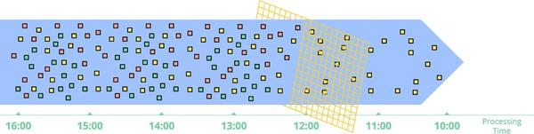
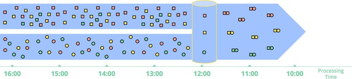
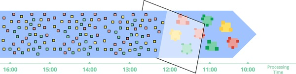
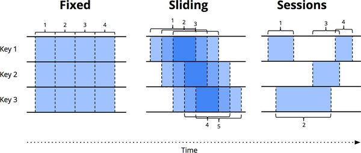

# 第一章 流式 101

大数据处理中的流式数据处理日益盛行，究其原因主要有以下几点:

* 企业期望更加及时的洞察数据，切换到流式进行处理以降低延迟是一个不错的选择

* 当今商业环境更多大量，无界的数据集普遍出现，需要对应的系统来处理这样的数据

* 数据到达后立即被处理，可以更好的使用资源和保证资源的一致性

尽管商业上对于流式系统的需求很强，但是长期而来，流式系统依旧不够成熟。目前这一事情有所缓解，我认为主要是我的[”流式101“](https://www.oreilly.com/radar/the-world-beyond-batch-streaming-101/)和[”流式102“](https://www.oreilly.com/radar/the-world-beyond-batch-streaming-102/)（本书的前几章是关于显然是基于此）两篇博客的刺激，目前工业界有很多人期望看到流式的蓬勃发展，也有很多同僚热衷于此。

尽管在前期的战斗中有一些收货，但是我依旧会强调一下在[”流式101“](https://www.oreilly.com/radar/the-world-beyond-batch-streaming-101/)中的一些概念，避免很多读者并不知道这个前置信息。本书是在这些观点基础上的一些发展。

开始之前，我们先确定一些在后面的章节可能会提到的专有概念:

**概念**

要准确地谈论复杂的主题，需要对概念有个清晰的定义。对于某些在当前使用中解释过多的术语，我会尽力确切地说出我想表达的意义。

**应用**

我认为，流式系统有它的缺点。也提出构建数据处理系统需要以解决现代数据消费者的需求向前发展。

**时域**

我介绍了与数据相关的两种主要时间处理，并展示它们之间是如何影响的，并指出处理这两种时间的一些困难。

**概念: 什么是流?**

先明确一下，什么是流？流现在含义众多（
为简单起见，到目前为止我一直在稍微简单地使用它），而且容易让人误入歧途。所以，我想重新定义流的定义。

关键问题是，过去更多的时候我们用”多少“来描述流（比如，有多少数据经过处理引擎），更多的时候其实应该用”什么“来描述（无界数据处理, 近似结果, 等等）。由于缺少这些精确的定义。导致流式系统长期依赖代表不精确和推测的结果。

一个精心设计的流式系统应该可以像批系统一样产出，正确的，一致的，可复现的结果。我倾向于给流一个特殊的定义：

**流式系统**: 用来处理无界数据集的数据处理引擎

假如我想来说低延迟、近似或者推测的结果，我会直接使用这些术语，而不是简单的说他们是流。

在我们讨论不同类型的数据的时候，精确的术语也是很重要的。在我看来，有两个重要的（也是正交的）维度来对一个数据集进行定义: 数据集的大小（cardinality）和数据的模型（constitution）。

在这里，我通常会使用两个专门的术语来粗略的描述数据集的大小:

**有界数据**: 一类数据有限的大小。

**无界数据**: 一类数据无限制的大小(至少理论上是这样的)。

了解被处理的数据的数据集大小是重要的，因为处理无界数据会面临更多的挑战，更多的细节会在后面讲行讨论。

另一方面，数据模型描述了对于数据的抽象，并且决定了数据的交互形式，目前不深入介绍，在第六章，将给深入的介绍，目前给出两个基础的表示方式：

**表**

在某一时刻对历史数据的视图。传统上，SQL系统就是用表格呈现数据的

**流**

随着时间，一个接一个的数据元素。传统上，MapReduce式处理系统处理的数据就是流

在第六、八、九章中，讲更加深入的介绍表与流之间的关系，在第八章将学到它们随着时间变化的一些联系。但是，现在我们主要介绍流的，因为目前有很多开发人员直接参与大多数数据处理系统进行程序开发（包括批处理和流处理）。当然，这也体现的开发流式处理系统是有其自身的挑战。

**流处理的局限性**

接下来让我们明确一下流系统可以做什么和不能做什么。从历史上看，流式系统一直局限于提供低延迟，不准确或推测性结果的小众市场，通常与功能更强大的批处理系统结合使用，以提供最终正确的结果。换句话说，它其实就是Lambda架构。

Lambda架构的基本思想是运行两套系统，一套是流式的，一套是批量的，做同样的计算和处理，流式系统给一个低延迟的，但是不精确的结果。正确的结果，需要批量系统后续给出。这个概念最初由Twitter的Nathan Marz（也是[Storm](http://storm.apache.org/)的作者）提出。在当时的场景下，这样一个概念十分受到欢迎。但是Lambda也存在明显的问题，同时维护两套系统的代价和成本都很高，而且还要最终合并两条数据链路的结果。

我一直比较支持强一致的流式系统，同样比较赞成Jay Kreps（Kafka的作者之一）的文章["Questioning The Lambda Architecture"](https://www.oreilly.com/radar/questioning-the-lambda-architecture/)，Kreps使用可重放系统（类似Kafka，用作流式连接器）解决了上下文重复性问题，他提出了Kappa架构，利用单个系统来实现需求，而不是利用流式和批处理两套系统。我不认同一个架构名称需要使用自己的希腊字母名称，但是我原则上完全支持这个想法。:)

老实说，我会更进一步。我会说好的流系统设计实际上应该包含批处理系统的所有功能，或者说，流系统应是批处理系统的超集。当前应该没有必要存在批处理系统的。同时，向Apache Flink员工表示敬意，希望他们牢记这个想法，并建立一个真正的流式处理系统: 在任何时间，将所有信息流式传输，即使在批处理模式下；我喜欢它。

流处理系统结合了强大的框架进行无界数据处理, 现在是时候把Lambda架构放到它该放的大数据处理的历史长廊里了。因为这样做（也就是说，流胜过批处理），您真的只需要两件事:

**正确性**

在这一点上，流处理与批处理是一致的。核心是归结为
一致的存储。流系统需要一种检查点（Checkpointing）的方法持续的状态（Kreps在他的[“为什么局部状态是流处理中的基本原语”](https://www.oreilly.com/content/why-local-state-is-a-fundamental-primitive-in-stream-processing/)，并且它必须设计得足够好，以根据机器保持一致失败。当Spark框架首次出现在公共大数据中时几年前的场景，这是流式处理需要强一致性的立标。值得庆幸的是，目前情况已大大改善。但是，值得注意的是，目前仍然有一些流式系统，在没有很强一致性存储情况下，尝试流式数据处理...

重申一点，对于精确一次(Exactly-once)的处理方式，强一致性是必要条件，而且对于任何想对齐和超越批量系统的流式系统，强一致性都是不可或缺的。除非你只是真的不在乎您的结果，我恳请您避免任何流式传输无法提供高度一致状态的系统。批处理系统不要求您提前核实它们是否能够生产正确答案;不要将时间浪费在流式系统处理上，因为这样是无法得到相同结果的。

如果您想了解更多有关增强能力的知识流系统的一致性，建议您检查一下
[MillWheel](https://static.googleusercontent.com/media/research.google.com/zh-CN//pubs/archive/41378.pdf)、[Spark Streaming](https://people.csail.mit.edu/matei/papers/2012/hotcloud_spark_streaming.pdf)和[Flink snapshotting](https://arxiv.org/pdf/1506.08603.pdf)的论文。这三个人都花费大量时间讨论一致性。鲁文（Reuven）将在第五章中介绍一致性保证。

**合理的时间处理工具**

这是流式系统优于批量系统的地方。一个好的时间处理工具对处理无界数据是十分必要的。现在越来越多的数据集展示了这些特性，现有的批处理系统（以及许多流系统）缺少必要的工具来应对它们带来的困难（尽管现在我写这篇文章时，它正在迅速改变）。我们会花本书的大部分内容解释这一块的内容。

首先，我们对*时域*概念有基本的了解，之后我们将更深入地了解变化的事件是时间偏斜的无界、无序数据。然后我们花本章的其余部分介绍使用批处理和流系统进行有界和无界数据处理的常见方法。

**事件时间(Event time) VS 处理时间(Processing Time)**

要说明无界数据的处理需要明确了解所涉及的时间范围。在任何数据处理系统中，通常我们关心两个时间域：

**事件时间(Event time)**

事件实际发生的时间

**处理时间(Processing time)**

系统处理事件的时间

并非所有用例都关心事件的时间（如果您不关心事件的发生，太好了！那样处理起来会更加轻松）。但事实上，很多处理系统都需要对时间的处理。比如：包括表征用户行为随着时间的流逝，大多数计费应用程序以及许多异常行为的检测。

在理想的情况下，事件时间和处理时间将始终相等，事件发生时会立即进行处理。现实并非如是，事件时间和处理时间之间通常存在着的偏差(Time skew)。下面例举一些可能影响这个偏差的因素：

* 共享资源限制，例如网络拥塞，网络分区或非专用环境中的共享CPU

* 软件原因，例如分布式系统逻辑，竞争等等

* 数据自身的原因，例如密钥分配，吞吐量或无序变化，而导致数据离线或者上线

如果您以任意时间绘制事件时间和处理时间的进度真实系统，最终结果就像图 1-1

 
 
 图 1-1. 时域关系图。 x轴表示事件时间; 也就是说，事件时间中的时间X，所有事件时间小于X的数据已经观察到。 y轴表示处理时间的进度；那是正常的数据处理系统执行时观察到的时钟时间。

斜率为1的黑色虚线代表理想情况，处理时间和事件时间完全重合的地方；红线代表现实情况。在此示例中，系统在开始时滞后了一点处理时间，在中间偏向理想，然后滞后再次接近终点。每个表示不同的时域特征:

**处理时间延迟**

理想线和红线之间的垂直距离是处理时间延迟。那个距离告诉你多少延迟在给定时间内事件之间的观察时间（处理时间内）发生和处理它们的时间之间。这也许是更多两个偏斜的自然和直观。

**事件时间偏差**

理想线和红线之间的水平距离为当时管道中的事件时间偏斜。告诉我们事件真实被处理的时间离理想情况下的事件时间有多大的偏差。

在实际情况下，处理时间延迟和事件时间偏差应该是相等的，只是对于同一件事情使用的描述角度不同而已。需要注意的一点是，由于p处理时间和事件时间之间的差距是动态变化的，如果你很关心事件时间你很难在上下文中得到有利的信息（解释一下，这一段有点绕，我觉得作者想说的是，如果你想知道当天事件时间后面是否还有对应的数据，比如比他早或者晚的数据，你很难通过你已经读取的数据判断，比如你现在看到了一条事件时间08:00的数据，后面来的都是08:01的了，那是不是说明08:00点之前的数据没有了，这并不代表，应该有可能有一些07:59的数据卡在了某些地方，很难以用已知信息进行预测。如果事件时间偏差固定的就能预测了）。我们后面一节里更加详细的讨论这个问题。

不幸的是，按事件时间作为系统处理的Window时，这个图要展示的内容并不是那么完美。很多系统为了更好的处理流式数据，都会提供窗口计算，稍后会对窗口计算做更加深入的介绍，本质上窗口计算就是在时间的维度上把无界数据切割成若干片段。如果你关心正确性，并且想用事件时间来做窗口计算，显然处理时间是不适用的。但是在实际实现的系统当中很多时候都是用处理时间来做的窗口计算，而本来打算用事件做窗口的...，从而导致结果不准确。（解释一下，现在好多系统要么没区分事件时间，处理时间，要么不支持处理时间或者事件时间）

现在很多系统是与要求的，但是对于处理时间和事件时间之间的时间偏差，目前的系统又不能预测，所以这是一个问题。

在详细介绍解决这个问题的方法之前，让我们先书介绍一个有用的背景知识：通用数据处理模式

**数据处理模型**

至此，我们已经建立了足够的背景，可以开始研究常见有界和无界的数据处理模型了。我们研究这两种处理方式，在我们关注的两种主要发动机类型的背景下关于（批处理和流处理，在这种情况下，实质上是微批加入了流处理，因为两者之间的差异并不是十分重要）。

**有界数据**

从概念上讲，处理边界数据非常简单，很可能大家都比较熟悉。在图1-2中，我们从左侧开始，有一个完整的数据集的熵。我们通过一些数据处理引擎（通常是批处理，尽管精心设计的流式处理引擎也可以正常工作），例如MapReduce，然后获得右侧一个新的结构化数据集，通常该数据集具有更大的商业价值。

 

图1-2。使用经典批处理引擎的有限数据处理。一个有限的数据左侧的非结构化数据通过数据处理引擎处理，得到右侧对应的结构化数据

当然，实际上可以做的事情还有很多变化作为该方案的一部分，整体模型非常简单。有趣的是处理无界数据集的任务。现在来看通常，从无界数据处理开始使用传统批处理引擎使用的方法，然后以设计出可用于无界数据的系统可以采用的方法，例如大多数流式或微批数据处理引擎。

**无界数据: 批处理**

在批处理引擎设计之初，虽然没有明确设计为考虑到无界数据，但是自批处理面世以来，一直有用于处理无界数据的思想。如您所料，这个思想不断发展出一个新的思路————即将无界数据分割成一组有界的数据集，然后用批处理引擎处理。

**固定窗口**

处理无界数据的最常见方法使用重复运行批处理引擎的工作原理是将输入数据放到固定大小的窗口中，然后将这些窗口中的每一个作为独立的有界数据源进行处理（有时也称为翻滚窗口），如图1-3所示。特别是对于输入源（例如日志），因为可以将日志事件写入目录和文件中，其名称编码与之对应的窗口的层次结构。事情看起来很简单，执行基于时间的将数据放入适当的事件时间提前配置好的窗口即可。

然而，大多数系统仍然存在完整性问题需要处理（如果您的某些事件由于网络分区被分隔在不同的位置？如果您的事件在全球范围内收集并且必须在处理之前转移到同一个位置？如果您的事件怎么办来自移动设备？），这意味着把数据延后处理的操作是必要的（例如，直到您确定所有事件都已经到达时再进行处理，或者重新处理整个晚到达的数据窗口批次）。

 

图 1-3. 经典的批处理引擎处理临时固定窗口的无界数据流程图。无界数据集被预先收集到有限的固定大小的窗口中成为“有界数据”，然后通过连续运行批处理引擎进行数据处理。

**会话**

当您尝试使用上述将无界数据处理成更复杂的窗口化策略，然后来进行批处理引擎来解决会话问题，这甚至会直接导致引擎崩溃。会话通常被定义为处理任务的周期（例如，特定用户），闲置时被终止。当批处理引擎在一个计算上下问使用会话时，通常需要对会话进行拆分。如图1-4中的红色标记所示。我们可以通过增加批的大小来减少分割的次数，其代价是增加计算延迟。另一个选择是添加处理逻辑从上一次运行的历史记录以重现完整的会话，让会话这个问题越来越复杂了。

 

图 1-4. 使用批处理引擎，通过设计的固定窗口将无界数据分隔成有限的固定大小的有界数据集，然后将固定大小的有界数据集再细分为动态会话窗口连续在批处理引擎中运行。

无论哪种方式，使用经典的批处理引擎来计算会话都不是太理想。更好的方法是以流式建立会话，我们稍后再讨论。

**无界数据: 流处理**

与大多数即席的基于批处理的无界数据处理的性质相反，流系统是为界数据而构建的。正如我们所说的关于较早的版本，对于许多实际的分布式输入源，您不仅发现自己正在处理无界的数据集，而且还处理诸如:

* 高度混乱的事件时间。这意味着，如果您想在事件数据产生的上下文中分析数据，可能需要在管道中进行某种基于时间的排序操作。

* 各种事件时间上的偏差。这意味着，您不能仅仅假设您将始终在给定事件时间X内看到大多数数据时间Y的一些恒定ε。（这个翻译不够准确，作者的大意是，在t时刻，经过恒定ε时间后，到达t'时间，我们不能假设在ε时间总是能观测到与t'-t可观测到相同的事件数量）

处理数据时可以采取几种方法具有这些特征。我通常将这些方法归类为四组：时间不敏感、近似、按处理时间作窗口和按事件时间作窗口。

现在，让我们花一些时间来研究上述四种方法吧。

**时间不敏感**

时间不敏感是指对数据处理与时间无关，也就是说，所有的逻辑处理是由数据驱动的。这样的处理逻辑通常取决于后续达到的数据。除了基本数据传递外，对流式处理引擎没有其他特殊支持的功能。因此，所有大部分的流式系统都支持时间未知的数据模型处理，而且能做到开箱即用。批处理系统也只需简单地把无界数据源切成任意有界数据集并独立处理这些数据集。我们来看几个
本节中的具体示例，但考虑到处理时间不可知的处理（至少从时间角度而言），我们除此之外，将不会花费更多的时间。

***过滤***

常见的应用时间不敏感方法的数据处理应用就是过滤操作，如图 1-5。想象一下您正在处理网络流量日志，并且您想要过滤掉并非来自特定网站的所有流量域。您会查看每条到达的记录，看看它是否属于感兴趣的域，如果没有则将其删除。因为这种事情只取决于任何时候在单个元素上，数据源是否无界、是否有序、事件时间是否有偏差都是无关紧要的。

 

图1-5 无界数据的过滤操作。被收集的各种不同类型数据（从左向右流动）被过滤到包含单个类型的同一集合中。

***内联***

时间不敏感方法的另一应用场景是内联，如图 1-6。当连接两个无界数据源时，如果只关心结果来自两个来源的元素到达时的联接时间。看到从某一个数据源流入的数据元素，您可以简单地以持久状态缓冲它；仅在另一个数据流流入的第二个数据元素到达之后，决定是否需要发出合并操作。（实际上，您可能需要设计某种针对未使用的部分联接的垃圾回收策略，可能是基于时间的。但是对于很少或没有未完成数据元素的加入，这样的事情可能并不是什么大问题。）

 

图1-6 无界数据的内联操作。可以观察到，来自两个数据源的元素被匹配后，进行了内联输出。

当切换语义环境到一些外联操作时，我们通常介绍数据的完整性问题——当一数据源中的元素已经进入联合操作，如何确认另一数据源的中元素是否到达? 老实说，你不知道，所以你需要学习超时这一概念，它引入了元素的时间。元素的时间本质上是窗口的一种形式，后面我们会进行更详细的讨论。

**近似算法**

第二类处理方法主要是使用近似算法，比如: [近似Top-N](https:)、[流式k-means](https:)等等。把无界的数据作为输入源，并提供相应的输出。如果你斜视它们，看起来或多或少像您希望得到的，如图1-7。从设计上来说，近似算法的为无界数据源设计带来的开销很低，这是这这它的优点。但是，算法实现太少，近似算法本身通常很复杂（这使得它很难与新的算法组合在一起工作），并且它近似性质限制了它所使用的场景。

 

图1-6 计算无界数据的近似值。数据通过复杂的近似算法，产生的输出数据或多或少看起来像是所需要。

值得注意的是，这些算法通常确实具有设计中的时间衰变。而且它们是在元素到达时即被处理，该时间元素通常是基于处理时间的。对于提供某种形式的近似误差可证明的误差范围是十分重要的。这些误差范围是以数据按有顺序到达为前提的。需要记住，当您以不同的事件时间偏斜为近似算法提供无界数据，此时近似算法计算的结果将毫无意义。

逼近算法本身是一个引人入胜的主题，但由于它们本质上是时间不可知处理的另一个示例（以算法本身的时间为特征）。它们非常简单，但鉴于我们当前的关注点，因此不值得进一步关注。

**窗口**

其余两种用于无界数据处理的方法都是基于窗口的。在深入探讨它们之间的差异之前，我应该清楚地表明我所说的窗口化是什么意思，因为我们在上一节中仅简要介绍了它。窗口仅仅是获取数据源（无界或有界）并进行合适的切割到有限的块中进行处理计算。图1-8 显示了三种不同的窗口模式。

 

图1-8。窗口化策略。每个示例都显示了三个不同的关键点，突出显示对齐窗口（适用于所有数据）和未对齐的窗口（适用于部分数据）之间的差异。

让我们再仔细地探讨每种策略：

***固定窗口（通常也叫作翻滚窗口）***

我们之前讨论了固定窗口。固定窗口切片时间为具有固定大小的时间长度。通常（如图1-9），固定窗口的各个段均匀地应用于整个数据集，这是对齐窗口的示例。在某些情况下，最好对不同子集的窗口进行相移（phase-shift）数据（例如，每个键）以更均匀地分布窗口完成时间负载，这是未对齐窗口的一个示例，因为它们是跨数据而变化的。

***滑动窗口（通常也叫作跳动窗口, hopping windows）***

